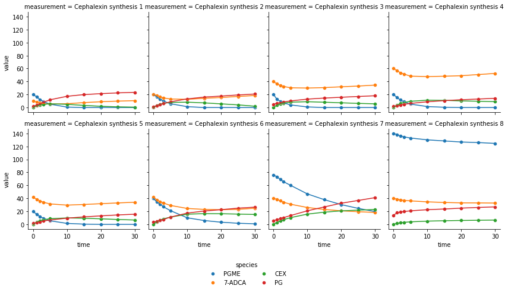
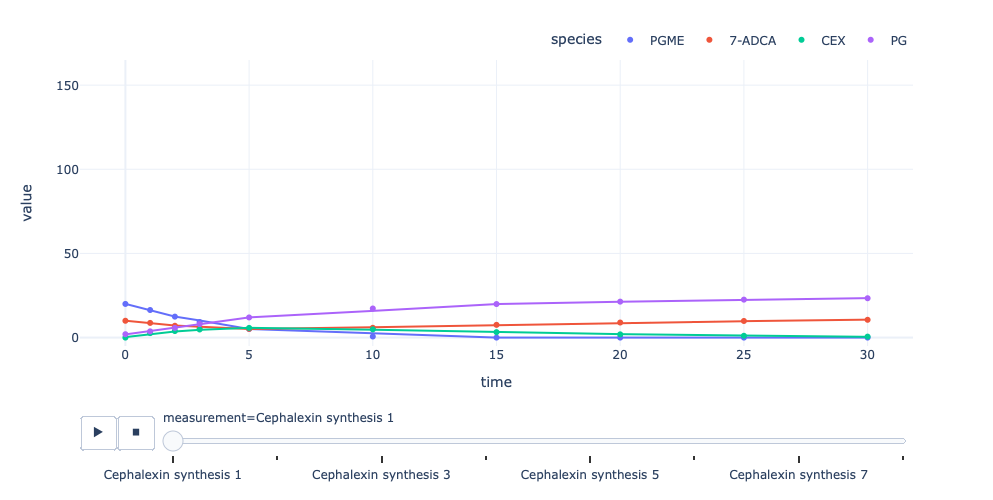
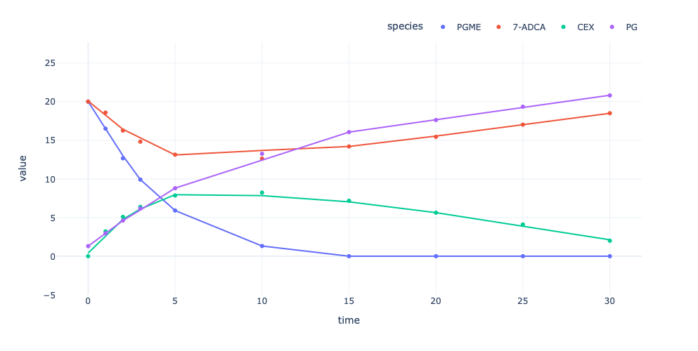

Visualisation of an EnzymeML document
=====================================

PyEnzyme offers the ability to visualize experimental data present in an
EnzymeML document for inspection and publication. The method can be
specified such that either static or interactive visualisations are be
returned. In addition, the visualisation can be parametrized to specific
measurements by using the ``measurement_ids`` argument to only visualize
a subset of the given data.

The following example will demonstrate the usage of the
``visualize``-method as well as how to display only a single measurement
and a subset. It should be noted, that the method returns an object to
further optimize the plot to your needs.

.. code:: ipython3

    import pyenzyme as pe

.. code:: ipython3

    # Load the EnzymeML document at first
    enzmldoc = pe.EnzymeMLDocument.fromFile("Model_4.omex")

Visualising all measurements
----------------------------

Static
~~~~~~

By default the ``visualize``-method returns a static scatterplot and by
utilizing the ``use_names`` argument the species IDs will be converted
to their actual names for an improved readability. Furthermore,
trendlines can be added by using the ``trendline`` argument.

.. code:: ipython3

    fig = enzmldoc.visualize(use_names=True, trendline=True)

Interactive
~~~~~~~~~~~

Interactive visualisations behaves the same way and are returned when
the ``interactive`` argument is set to ``True``. These plots are based
on ``Plotly`` and offer controls such as a Zoom, an Export as well as a
selection of which species should be displayed.

.. code:: ipython3

    enzmldoc.visualize(interactive=True, trendline=True, use_names=True)

-----------------------------------

It is not always desired to visualize all data but a single or subset of
the given data. This can be done by using the
``measurement_ids``\ argument, where measurement IDs are given as a list
of strings. Since these apply to both interactive and static
visualisations, the following will only display the interactive case for
a single measurement.

.. code:: ipython3

    # FYI: Measurement IDs always start with an "m"
    enzmldoc.visualize(interactive=True, use_names=True, trendline=True, measurement_ids=["m1"])

One last thing
~~~~~~~~~~~~~~~~~

If you are not sure about the ID of the measurements you’d like to
visualize, use the ``printMeasurements``-method in the
``EnzymeMLDocument`` object. It will not only display the IDs and names
of your measurements, but also the initial concentrations assigned to
each species.

.. code:: ipython3

    enzmldoc.printMeasurements()

.. parsed-literal::

    >>> Measurement m0: Cephalexin synthesis 1
        s0 | initial conc: 20.0 mmole / l 	| #replicates: 1
        s1 | initial conc: 10.0 mmole / l 	| #replicates: 1
        s2 | initial conc: 0.0 mmole / l 	| #replicates: 1
        s3 | initial conc: 2.0 mmole / l 	| #replicates: 1
        p0 | initial conc: 0.0002 mmole / l 	| #replicates: 0
    >>> Measurement m1: Cephalexin synthesis 2
        s0 | initial conc: 20.0 mmole / l 	| #replicates: 1
        s1 | initial conc: 20.0 mmole / l 	| #replicates: 1
        s2 | initial conc: 0.0 mmole / l 	| #replicates: 1
        s3 | initial conc: 1.3 mmole / l 	| #replicates: 1
        p0 | initial conc: 0.0002 mmole / l 	| #replicates: 0
    >>> Measurement m2: Cephalexin synthesis 3
        s0 | initial conc: 20.0 mmole / l 	| #replicates: 1
        s1 | initial conc: 40.0 mmole / l 	| #replicates: 1
        s2 | initial conc: 0.0 mmole / l 	| #replicates: 1
        s3 | initial conc: 5.1 mmole / l 	| #replicates: 1
        p0 | initial conc: 0.0002 mmole / l 	| #replicates: 0
    >>> Measurement m3: Cephalexin synthesis 4
        s0 | initial conc: 20.0 mmole / l 	| #replicates: 1
        s1 | initial conc: 60.0 mmole / l 	| #replicates: 1
        s2 | initial conc: 0.0 mmole / l 	| #replicates: 1
        s3 | initial conc: 1.9 mmole / l 	| #replicates: 1
        p0 | initial conc: 0.0002 mmole / l 	| #replicates: 0
    >>> Measurement m4: Cephalexin synthesis 5
        s0 | initial conc: 20.0 mmole / l 	| #replicates: 1
        s1 | initial conc: 42.0 mmole / l 	| #replicates: 1
        s2 | initial conc: 0.0 mmole / l 	| #replicates: 1
        s3 | initial conc: 1.5 mmole / l 	| #replicates: 1
        p0 | initial conc: 0.0002 mmole / l 	| #replicates: 0
    >>> Measurement m5: Cephalexin synthesis 6
        s0 | initial conc: 40.0 mmole / l 	| #replicates: 1
        s1 | initial conc: 42.0 mmole / l 	| #replicates: 1
        s2 | initial conc: 0.0 mmole / l 	| #replicates: 1
        s3 | initial conc: 3.3 mmole / l 	| #replicates: 1
        p0 | initial conc: 0.0002 mmole / l 	| #replicates: 0
    >>> Measurement m6: Cephalexin synthesis 7
        s0 | initial conc: 76.0 mmole / l 	| #replicates: 1
        s1 | initial conc: 40.0 mmole / l 	| #replicates: 1
        s2 | initial conc: 0.0 mmole / l 	| #replicates: 1
        s3 | initial conc: 5.7 mmole / l 	| #replicates: 1
        p0 | initial conc: 0.0002 mmole / l 	| #replicates: 0
    >>> Measurement m7: Cephalexin synthesis 8
        s0 | initial conc: 140.0 mmole / l 	| #replicates: 1
        s1 | initial conc: 40.0 mmole / l 	| #replicates: 1
        s2 | initial conc: 0.0 mmole / l 	| #replicates: 1
        s3 | initial conc: 14.0 mmole / l 	| #replicates: 1
        p0 | initial conc: 0.0002 mmole / l 	| #replicates: 0

