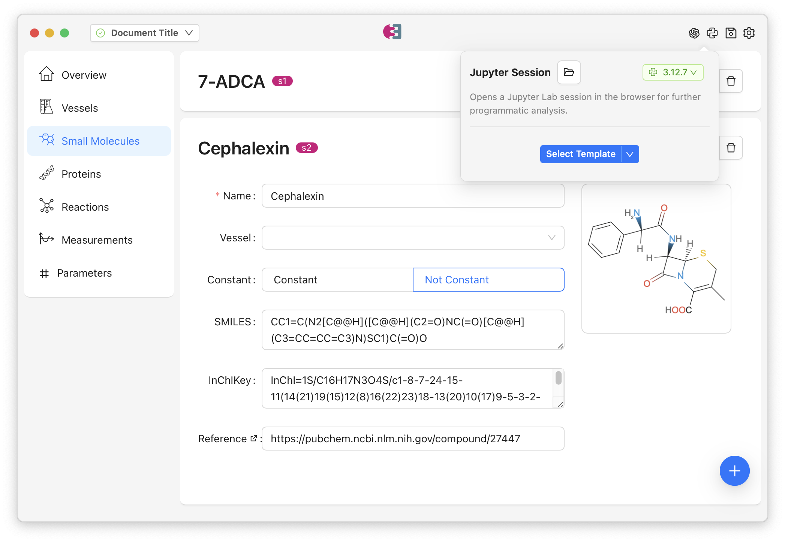

The [EnzymeML Suite](https://github.com/EnzymeML/enzymeml-suite) is a modern desktop application for creating, editing, and visualizing EnzymeML documents through an intuitive graphical user interface. It provides a comprehensive visual environment for managing enzyme kinetics data, experimental measurements, and computational modeling workflows. While PyEnzyme excels at programmatic document creation and analysis, the Suite offers a visual, point-and-click interface.

The `pyenzyme.suite` module bridges these two worlds, enabling seamless data exchange between the Suite's graphical interface and Python scripts. This integration means you can leverage the strengths of both tools: use the Suite's visual interface to create and edit documents interactively, then pull those documents into Python for computational analysis, modeling, or data processing. When you're done with your Python analysis, you can push the results back to the Suite for visualization and further editing. This round-trip workflow combines the convenience of visual editing with the power of programmatic analysis.



## Understanding the Connection

When the EnzymeML Suite desktop application is running, it starts a local HTTP server that listens for connections. The Suite integration in PyEnzyme communicates with this server to fetch documents that are currently open in the Suite, retrieve specific documents by their ID, or update documents with modifications made in Python.

This architecture means that the Suite and your Python scripts can work together in real-time. You can have the Suite open with a document visible on your screen and directly re-use the same document in Python for analysis. This seamless integration is particularly powerful when you're performing modeling and parameter fitting in Python.

## Connecting to the Suite

Before you can exchange data with the Suite, you need to establish a connection. The first step is to ensure the EnzymeML Suite desktop application is running. You can download the Suite from the [releases page](https://github.com/EnzymeML/enzymeml-suite/releases) or build it from source if you prefer. Once the Suite is running, it will automatically start its HTTP server, and you're ready to connect from Python.

To create a connection, you'll import the `EnzymeMLSuite` class and create an instance:

```python
from pyenzyme.suite import EnzymeMLSuite

# Connect to the Suite (defaults to http://localhost:13452)
suite = EnzymeMLSuite()
```

In this code, we're creating a new `EnzymeMLSuite` object that will handle communication with the Suite. By default, it connects to `http://localhost:13452`, which is where the Suite runs its server. If your Suite is configured to run on a different port or address, you can specify that when creating the connection:

```python
# Connect to a Suite running on a different port
suite = EnzymeMLSuite(url="http://localhost:8080")
```

The `EnzymeMLSuite` object maintains an HTTP client connection internally, so once you've created it, you can use it to make multiple requests without needing to reconnect each time.

## Fetching Documents from the Suite

Once you've established a connection, you can retrieve EnzymeML documents that are currently open in the Suite. This is useful when you've created or edited a document visually in the Suite and want to analyze it programmatically in Python, or when you want to process documents that were created by colleagues using the Suite's interface.

The most common operation is fetching the document that's currently active in the Suite. This is the document that's visible in the Suite's main window:

```python
# Get the document currently open in the Suite
doc = suite.get_current()

# Now you can work with it in Python
print(f"Document: {doc.name}")
print(f"Number of measurements: {len(doc.measurements)}")
print(f"Number of proteins: {len(doc.proteins)}")
```

In this example, `get_current()` retrieves the active document from the Suite and returns it as a standard `EnzymeMLDocument` object. Once you have this object, you can work with it exactly as you would with any EnzymeML document created programmatically in Python. You can access its properties, modify its contents, add new entities, or use it with PyEnzyme's analysis tools.

The function returns a complete `EnzymeMLDocument` with all its associated data: vessels, proteins, small molecules, reactions, measurements, equations, and parameters. Everything that was visible in the Suite is now available in your Python environment.

If the Suite is managing multiple documents, you can also fetch a specific document by its ID:

```python
# Get a specific document by ID
doc = suite.get_document(id="doc_123")

# Work with it
print(f"Retrieved document: {doc.name}")
```

This is useful when you're working with multiple documents and need to process them programmatically, perhaps as part of a batch processing workflow or when you're building automated analysis pipelines.

## Updating Documents in the Suite

After you've fetched a document and made modifications in Python, you'll often want to push those changes back to the Suite so they're visible in the graphical interface. This is particularly valuable when you've performed computational analysis, added parameters through fitting, or enriched the document with information from databases.

To update the Suite with your modified document, use the `update_current()` method:

```python
import pyenzyme as pe

# Modify the document in Python
doc.name = "Updated Document Name"
doc.add_to_parameters(
    id="kcat",
    name="Catalytic rate constant",
    value=150.0,
    unit="1 / s"
)

# Update the Suite with your changes
suite.update_current(doc)
```

When you call `update_current()`, PyEnzyme sends your modified document back to the Suite, which then refreshes its display to show your changes. The Suite will update all its views: if you added a new parameter, it will appear in the parameters list; if you modified measurement data, those changes will be reflected in the data tables and visualizations.

This round-trip workflow—fetching from Suite, modifying in Python, updating back to Suite—enables a powerful iterative process where you can leverage both visual editing and programmatic analysis in the same workflow.

## A Complete Workflow Example

To illustrate how these pieces fit together, here's a complete example showing a typical round-trip workflow between the Suite and Python:

```python
import pyenzyme as pe
from pyenzyme.suite import EnzymeMLSuite

# 1. Connect to the Suite
suite = EnzymeMLSuite()

# 2. Fetch the current document from the Suite
print("Fetching document from Suite...")
doc = suite.get_current()
print(f"Loaded: {doc.name}")

# 3. Perform analysis in Python
print(f"Document has {len(doc.measurements)} measurements")

# Add a new parameter programmatically
if not any(p.id == "kcat" for p in doc.parameters):
    doc.add_to_parameters(
        id="kcat",
        name="Catalytic rate constant",
        value=100.0,
        unit="1 / s",
        lower_bound=10.0,
        upper_bound=1000.0
    )
    print("Added kcat parameter")

# 4. Update the Suite with your changes
print("Updating Suite...")
suite.update_current(doc)
print("Document updated in Suite!")
```

In this workflow, we start by connecting to the Suite, then fetch the currently active document. We perform some analysis—in this case, checking if a parameter exists and adding it if it doesn't—then push our changes back to the Suite. This pattern of fetch-modify-update is the core of the Suite integration and enables seamless collaboration between visual and programmatic workflows.

## Integration with Jupyter Notebooks

The Suite includes built-in Jupyter templates that are designed to work seamlessly with PyEnzyme. These templates provide pre-configured notebooks for common modeling tasks like basic analysis, Bayesian parameter inference, neural ODE modeling, and more. When you launch Jupyter Lab from within the Suite, it automatically sets up the environment to work with the current document.

Here's how you might use the Suite integration within a Jupyter notebook launched from the Suite:

```python
from pyenzyme.suite import EnzymeMLSuite

# Connect to the Suite
suite = EnzymeMLSuite()

# Get the current document
doc = suite.get_current()

# Perform your analysis
import pyenzyme.equations as peq
from pyenzyme.thinlayers import ThinLayerPysces

# Add equations if needed
doc.equations += peq.build_equations(
    "product'(t) = kcat * enzyme * substrate / (Km + substrate)",
    unit_mapping={"kcat": "1 / s", "Km": "mmol / l"},
    enzmldoc=doc
)

# Create a thin layer for simulation
tl = ThinLayerPysces(doc)

# Simulate
results, time = tl.integrate(
    model=doc,
    initial_conditions={"substrate": 10.0, "product": 0.0},
    t0=0.0,
    t1=100.0,
    nsteps=200
)

# Update back to Suite
suite.update_current(doc)
```

This integration means you can start your analysis in the Suite's visual interface, launch Jupyter for computational modeling, and seamlessly work with the same document in both environments. The Suite's templates handle the initial setup, and PyEnzyme's Suite integration ensures your changes flow back to the Suite when you're done.

## Handling Connection Errors

When working with the Suite integration, you may encounter connection errors if the Suite isn't running or isn't accessible. PyEnzyme provides helpful error messages to guide you when something goes wrong:

```python
from pyenzyme.suite import EnzymeMLSuite

try:
    suite = EnzymeMLSuite()
    doc = suite.get_current()
except ConnectionError as e:
    print(f"Error: {e}")
    print("Make sure the EnzymeML Suite is running!")
```

The most common issue is that the Suite isn't running when you try to connect. The `ConnectionError` will tell you that it couldn't connect to the Suite, which is your signal to start the desktop application. Once the Suite is running, you can retry your connection.

Other potential issues include the Suite running on a different port than expected, firewall settings blocking localhost connections, or network configuration problems. In most cases, the error message will point you toward the solution, but if you're having persistent connection issues, verify that the Suite is actually running and check its configuration to ensure it's listening on the expected address and port.

## Use Cases

The Suite integration enables several powerful workflows that combine visual editing with programmatic analysis:

**Visual Document Creation with Python Analysis**: You can use the Suite's GUI to create EnzymeML documents visually, taking advantage of its intuitive interface for data entry. Once your document is set up, pull it into Python for computational analysis, parameter fitting, or modeling. After your analysis is complete, push the results back to the Suite to visualize them in the Suite's charts and graphs.

**Batch Processing**: If you have multiple documents in the Suite, you can process them programmatically:

```python
from pyenzyme.suite import EnzymeMLSuite
import pyenzyme as pe

suite = EnzymeMLSuite()

# Process multiple documents
document_ids = ["doc_1", "doc_2", "doc_3"]

for doc_id in document_ids:
    doc = suite.get_document(id=doc_id)
    
    # Perform batch processing
    # ... your analysis ...
    
    # Save processed version
    pe.write_enzymeml(doc, f"processed_{doc_id}.json")
```

**Automated Enrichment**: Combine Suite integration with PyEnzyme's database fetchers to automatically enrich documents with information from scientific databases:

```python
from pyenzyme.suite import EnzymeMLSuite
from pyenzyme.fetchers import fetch_uniprot, fetch_chebi

suite = EnzymeMLSuite()
doc = suite.get_current()

# Enrich document with database information
for protein in doc.proteins:
    if not protein.sequence:
        fetched = fetch_uniprot(protein.uniprot_id)
        protein.sequence = fetched.sequence

# Update back to Suite
suite.update_current(doc)
```

This workflow lets you start with a document that has basic information, automatically fill in missing details from databases, and see the enriched document updated in the Suite.

## Tips and Best Practices

When working with the Suite integration, keep these recommendations in mind:

**Always check that the Suite is running**: Before attempting to connect, make sure the EnzymeML Suite desktop application is actually running. The connection will fail immediately if the Suite isn't available, so it's best to start the Suite first before running your Python scripts.

**Handle connection errors gracefully**: Wrap your Suite operations in try-except blocks to handle cases where the Suite isn't running or isn't accessible. This makes your scripts more robust and provides better feedback when something goes wrong.

**Save your work**: While the Suite integration enables real-time updates, it's still good practice to save your documents to files periodically. This provides a backup and allows you to track changes over time. Use `pe.write_enzymeml()` to save documents to disk.

**Use meaningful document names**: When creating documents in the Suite, use descriptive names that will help you identify them when fetching by ID or when reviewing your work later.

**Leverage both interfaces**: Don't feel like you need to choose between the Suite and Python. Use the Suite for visual editing and exploration, and Python for computational analysis and automation. The integration makes it easy to switch between them.

## Next Steps

Now that you understand how to connect PyEnzyme with the EnzymeML Suite, you can combine visual editing with programmatic analysis in your workflows.

If you're new to creating EnzymeML documents, the [Creating documents](../basic/creating.mdx) guide will show you how to build documents programmatically from scratch. Understanding document structure will help you work more effectively with documents fetched from the Suite.

To learn about importing experimental data into PyEnzyme, check out the [Importing data](../basic/import.mdx) guide. You can import data into Python, then push it to the Suite for visual editing, or vice versa.

For computational modeling and parameter fitting, explore the [PySCeS integration](./pysces.mdx) or [COPASI integration](./copasi.mdx). These tools work seamlessly with documents fetched from the Suite.

Finally, visit the [EnzymeML Suite repository](https://github.com/EnzymeML/enzymeml-suite) to learn more about the Suite's features, including its AI-powered data extraction, Jupyter integration, and visualization capabilities.
